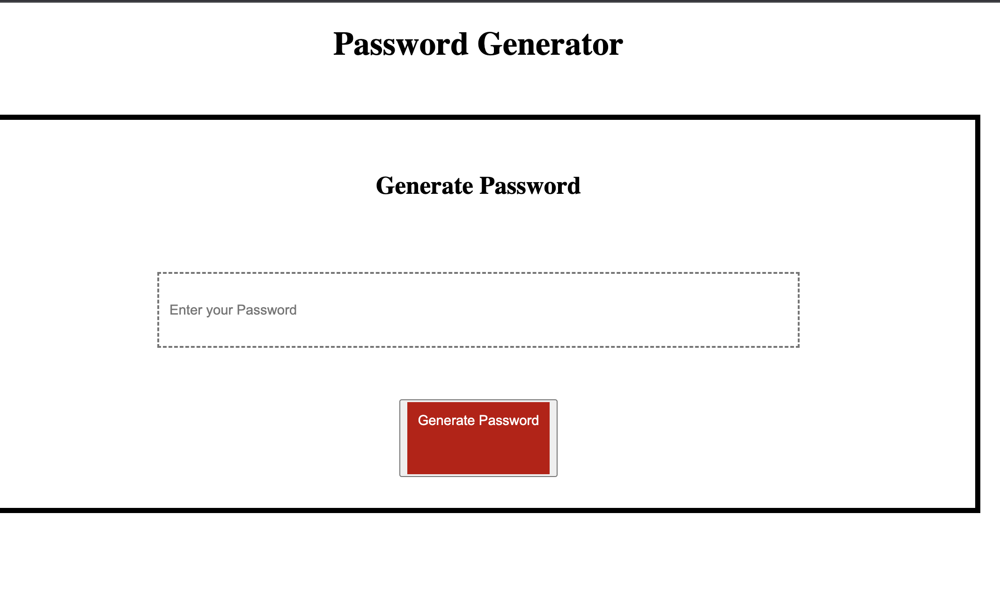

# Password Generator 

## Description

This app runs on the browser, and features dynamically updated HTML and CSS powered by Vanilla JavaScript.
- Made use of the prompt() function to display password options.
- Made used `if, else` statements and `for-loop` to cross check each criteria. 
- Made use of the inspect tools in the Chrome DevTools for testing and debugging. 

## Table of Contents

- [License](#License)
- [Future](#Future)
- [Credits](#Credits)
- [Contact](#Contact)

## License

License: MIT License

## Credits

Jose Escoto, Full Stack Development Student, University of Berkeley.

## Contact

For more questions please contact below:
Email: j.escoto@gmail.com
GitHub: [escotoj](https://github.com/escotoj)

